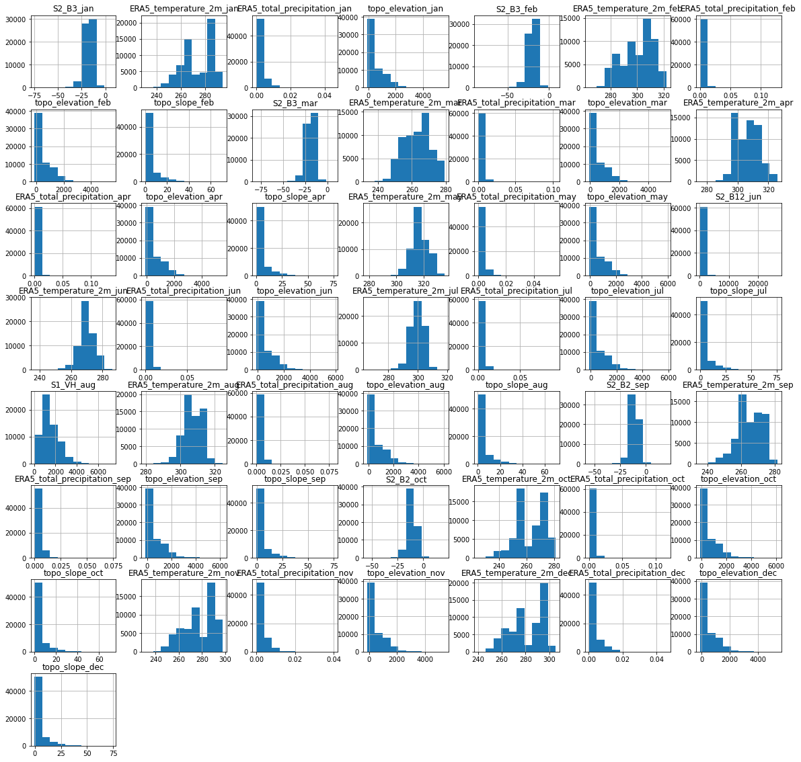
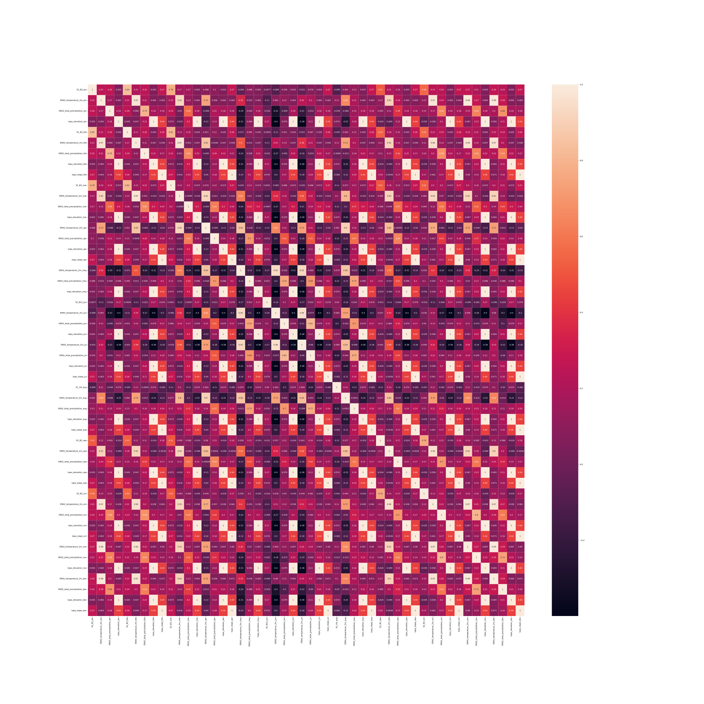
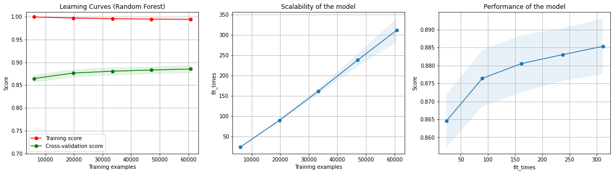

# Kaggle Competition 2 : CropHarvest

#### Team name "*Vongola Famiglia*"  : 
* Yassir Mamouni - Student Number : **20179687** - Kaggle ID : [Morphée](https://www.kaggle.com/yassirmamouni)
* Roméo Anawi - Student number **20170527** - Kaggle ID [Genkishi](https://www.kaggle.com/romeoanawi)

# Introduction
In this project, we participated in a Kaggle competition where the goal is to design a machine learning algorithm to classify locations around the world on 2 different classes :
* Crop land : **1**
* Non-crop land : **0**

To do so we have a dataset that containing 12 months of meteorological and climatological data. This set is composed of a 216 features subset of the [CropHarvest](https://openreview.net/pdf?id=JtjzUXPEaCu) dataset where each data points corresponds to a geographical location.

The goal of this project is to implement and train classification algorithms in order to have the highest performance on the test set available on Kaggle. The scoring in this competition is based on the [f1 score](https://en.wikipedia.org/wiki/F-score). 

Four baselines need to be beaten on this competition :

1. A dummy classifier that predicts the most frequent class in the set  : **0.71886**
2. A weak machine learning algorithm : **0.94736**
3. A stronger machine learning algorithm : **0.97841**
4. The TA's best baseline : **0.99516**

We will first see which algorithms and methodologies were done for this competition.
Then we will show and discuss our results.

# Methods
After checking on the 216 features, we checked for any redundancy and manage to manually **select 50 features**.

### Feature preprocessing 
To preprocess our dataset, we use [Power Transformer](https://scikit-learn.org/stable/modules/generated/sklearn.preprocessing.PowerTransformer.html) to render data more Gaussian like. Even though we used a lot of tree based method (see the [Models Used](#models-used) section), this preprocessing can help when using other models such as MLP.

### Training Pipeline
We put our training in a pipeline with the [`make_pipeline`](https://scikit-learn.org/stable/modules/generated/sklearn.pipeline.make_pipeline.html) module from Scikit-Learn. This helped us to train several models and stack them. To choose either the one with the best score, or to bag them in a Voting classifier.
#### Basic Pipeline
The basic pipeline trains and evaluates each model by using [`cross_val_score`](https://scikit-learn.org/stable/modules/generated/sklearn.model_selection.cross_val_score.html), a function that returns all the score of the [Stratified K-fold](https://scikit-learn.org/stable/modules/generated/sklearn.model_selection.StratifiedKFold.html) cross validation.
By taking the mean for each fold after evaluating and stacking their score in an array, we can see which model is performing better in general. 
The default number of fold for our cross validation during basic training is **5**.
After using that, we re fit our model by using [`SelectFromModel`](https://scikit-learn.org/stable/modules/generated/sklearn.feature_selection.SelectFromModel.html) 

#### Hyper Parameter tuning
The hyperparameter tuning is done by using a cross  validation grid search with [`GridSearchCV`](https://scikit-learn.org/stable/modules/generated/sklearn.model_selection.GridSearchCV.html). Our cross validation strategy is still [Stratified K-fold](https://scikit-learn.org/stable/modules/generated/sklearn.model_selection.StratifiedKFold.html) with **10** folds.

### Models used
* [Multi Layer Perceptron](https://scikit-learn.org/stable/modules/generated/sklearn.neural_network.MLPClassifier.html) : A "vanilla" feed forward artificial neural network  classifier implemented with Scikit Learn library [`MLP_Classifier`](https://scikit-learn.org/stable/modules/generated/sklearn.neural_network.MLPClassifier.html). We tried this model to see if it can perform well on our big number of features.
* [Random Forest](https://scikit-learn.org/stable/modules/generated/sklearn.ensemble.RandomForestClassifier.html) : A model that fits a certain number of [decision trees classifiers](https://scikit-learn.org/stable/modules/generated/sklearn.tree.DecisionTreeClassifier.html) on sub-samples of the dataset and uses the averaging to improve accuracy of predictions and control over-fitting.
* [AdaBoost](https://scikit-learn.org/stable/modules/generated/sklearn.ensemble.AdaBoostClassifier.html) : A meta-estimator that boost a classifier so that it can focus on most difficult cases. Our boosted model is a basic [Decision Tree classifier](https://scikit-learn.org/stable/modules/generated/sklearn.tree.DecisionTreeClassifier.html#sklearn.tree.DecisionTreeClassifier).
* [Voting](https://scikit-learn.org/stable/modules/generated/sklearn.ensemble.VotingClassifier.html) :  An ensemble method that trains on a numerous set of models and predicts the output based on voting with majority of models with the highest probability. Here we used Voting on our 3 previous classes.
  
# Results
Here we show the best hyper parameters and results we had for each models. Some other model were omitted from this report such as SVM and K-NN due to their poor results on Kaggle public test set.
The Competition has 2 set score : 
* A public set which is calculated with approximately 30% of the test data. 
* The final results on the test set based on the other 70%.

|   **Model**   |                               **Hyper Parameters**                               | **F-1 score (train set)**  | **F-1 score (public set)** | **F-1 score (private set)** |
|:-------------:|:--------------------------------------------------------------------------------:|:---------------------------:|:-----------------------------------------:|:------------------------------------------:|
|      *MLP*      | -Random state : **1**   -Activation Function : **tanh**   -Solver : **"Adam"** |         **0.863767**        |                **0.63707**                |                  **0.63844**                          |
| *Random Forest* (50 folds) |                              - n_estimator : **450**                             |         **0.885561**        |                **1.0**                |                   **0.99559**                         |
|    *AdaBoost*   |     -n_estimators : **100**   -learning rate : **0.01**    |         **0.848781**        |                **0.69721**                |                 **0.67013**                           |
|     *Voting*    |                                        NA                                        |              NA             |                **0.96470**                |                     **0.94836**                       |
# Discussion
After having those 3 results we were astonished by the drop with MLP and AdaBoost on the test set, but this is certainly due that we did prediction on the wrong `test_nolabels.csv` (reference on [piazza](https://piazza.com/class/kt0ir0ah1nk3ml?cid=207)). Our Random Forest works the best certainly because it is an ensemble of numerous decisions trees. Even though we discovered that **400** estimators gave us a better score on the final set (**0.99669**), the last model held by Kaggle is the one with 1.0 on the public set. This also means that **450** estimators made the model overfitting on the full set. 

## Statement of Contribution 
We hereby state that all the
work presented in this report is that of the authors

# References
* [CropHarvest](https://openreview.net/pdf?id=JtjzUXPEaCu)
*  [F-1 score](https://en.wikipedia.org/wiki/F-score)
* [Scikit-learn](https://scikit-learn.org/stable/) modules :
  * [Grid Search CV](https://scikit-learn.org/stable/modules/generated/sklearn.model_selection.GridSearchCV.html?highlight=grid\%20search#sklearn.model_selection.GridSearchCV)
  * [Power Transformer](https://scikit-learn.org/stable/modules/generated/sklearn.preprocessing.PowerTransformer.html)
  *  [Pipelining on Sklearn](https://scikit-learn.org/stable/modules/generated/sklearn.pipeline.make_pipeline.html)
  * [`cross_val_score`](https://scikit-learn.org/stable/modules/generated/sklearn.model_selection.cross_val_score.html)
  * [Stratified K-fold](https://scikit-learn.org/stable/modules/generated/sklearn.model_selection.StratifiedKFold.html)
  * [`SelectFromModel`](https://scikit-learn.org/stable/modules/generated/sklearn.feature_selection.SelectFromModel.html) 
  * [Multi Layer Perceptron](https://scikit-learn.org/stable/modules/generated/sklearn.neural_network.MLPClassifier.html)
  * [Decision tree classifiers](https://scikit-learn.org/stable/modules/generated/sklearn.tree.DecisionTreeClassifier.html)
  * [Random Forest Classifier](https://scikit-learn.org/stable/modules/generated/sklearn.ensemble.RandomForestClassifier.html?highlight=random\%20forest#sklearn.ensemble.RandomForestClassifier)
  * [AdaBoost](https://scikit-learn.org/stable/modules/generated/sklearn.ensemble.AdaBoostClassifier.html)
  * [Voting](https://scikit-learn.org/stable/modules/generated/sklearn.ensemble.VotingClassifier.html)
  * [Plotting learning and Validation curve](https://scikit-learn.org/stable/auto_examples/model_selection/plot_learning_curve.html#sphx-glr-auto-examples-model-selection-plot-learning-curve-py)

# Appendix
## Histogram of the training data with only selected features 

### Correlation matrix of the selected features

### Learning curve, scalability and performance on our Random Forest

